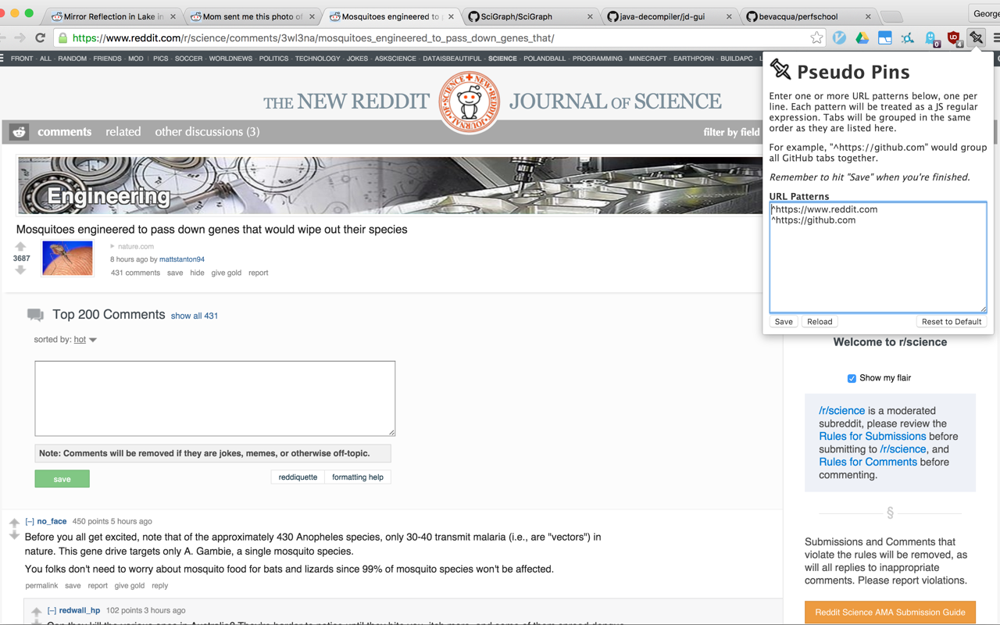

# Pseudo Pins

A Chrome extension that automatically rearranges tabs based on a set of regular
expressions provided by the user. This mimics, in a way, the "pin" behavior
built into Chrome since tabs that match a given expression are moved as far to
the left as possible and grouped together.

The extension attempts, within reason, to maintain its arrangements.

## Credits

Extension created by George Lesica (<george@lesica.com>).

Pin icon created by [Joe Harrison](https://thenounproject.com/joe_harrison/).
Retrieved from The Noun Project and modified, licensed CC-BY.

Question mark icon created by [Mateo
Zlatar](https://thenounproject.com/mateozlatar/). Retrieved from The Noun
Project, licensed CC-BY.
